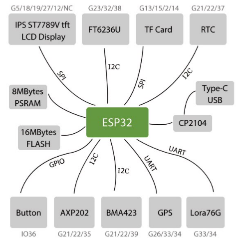

English | [中文](docs/details_cn.md) 

The code bin will demonstrate the basic functionality of T-Watch, including all on-board chips from T-Watch, using the latest lvgl6.0 as the display graphics framework.

# Characteristics:
1. The library already contains all the hardware drivers for `T-Watch`
1. Using TFT_eSPI as the display driver, you can directly call TFT_eSPI through the construction object.
1. Using lvgl 6.0 as the display graphics framework, the driver method has been implemented, you only need to call lvgl api according to your own needs.
1. For the use of lvgl please refer to **[lvgl docs](https://docs.littlevgl.com/en/html/index.html)**

# Installing
- Download a zipfile from github using the "Download ZIP" button and install it using the IDE ("Sketch" -> "Include Library" -> "Add .ZIP Library..."
- Clone this git repository into your sketchbook/libraries folder.
For more info, see https://www.arduino.cc/en/Guide/Libraries

# How to find the sample program
- In the Arduino board select `TTGO T-Watch`
- In the Arduino File -> Examples -> TTGO T-Watch

 # Note
- If you don't have the `TTGO T-Watch` option in your board manager, please update the esp32 board as follows:
  - Using Arduino IDE Boards Manager (preferred)
    + [Instructions for Boards Manager](docs/arduino-ide/boards_manager.md)
  - Using Arduino IDE with the development repository
    + [Instructions for Windows](docs/arduino-ide/windows.md)
    + [Instructions for Mac](docs/arduino-ide/mac.md)
    + [Instructions for Debian/Ubuntu Linux](docs/arduino-ide/debian_ubuntu.md)
    + [Instructions for Fedora](docs/arduino-ide/fedora.md)
    + [Instructions for openSUSE](docs/arduino-ide/opensuse.md)

 # Precautions:
- Since Twatch uses a special IO as the SD interface, please remove the SD card when downloading the program.

# About power consumption:
- At present, the power consumption of the screen (Non-deep sleep) is about 4mA, and the power consumption of the screen (WiFi and Bluetooth are not turned on) is about 65mA. For the specific code, please refer to `example -> SimpleWatch`.

  ## Off screen power consumption
  

  ## Open screen power consumption
  

# Architecture diagram

# Core Board Pinout
**TFT**

| ESP32 Core | GPIO5 | GPIO19 | GPIO18 | GPIO27 |
| :--------: | :---: | :----: | :----: | :----: |
|  ST7789V   |  CS   |  MOSI  |  SCLK  |   DC   |

**Button**

| ESP32 Core  | GPIO36 |
| :---------: | :----: |
| User Button | Button |

**Sensor**

| ESP32 Core | GPIO21 | GPIO22 |  GPIO39   |
| :--------: | :----: | :----: | :-------: |
|   BMA423   |  SDA   |  SCL   | Interrupt |

**PMU**

| ESP32 Core | GPIO21 | GPIO22 |  GPIO35   |
| :--------: | :----: | :----: | :-------: |
|   AXP202   |  SDA   |  SCL   | Interrupt |

**RTC**

| ESP32 Core | GPIO21 | GPIO22 |  GPIO37   |
| :--------: | :----: | :----: | :-------: |
|  PCF8563   |  SDA   |  SCL   | Interrupt |

**TOUCH**

| ESP32 Core | GPIO23 | GPIO32 |  GPIO38   |
| :--------: | :----: | :----: | :-------: |
|  FT6236U   |  SDA   |  SCL   | Interrupt |

**TF Card**

| ESP32 Core | GPIO13 | GPIO15 | GPIO2 | GPIO14 |
| :--------: | :----: | :----: | :---: | :----: |
|  TF Card   |   CS   |  MOSI  | MISO  |  SCLK  |

# Bottom plate Pinout

**Standard**

| ESP32 Core | GPIO33 | GPIO25  | GPIO21 | GPIO22 |
| :--------: | :----: | :-----: | :----: | :----: |
|  Standard  | Motor  | Speaker |  SDA   |  SCL   |
* Onboard SD card slot

**SIM800L**

| ESP32 Core | GPIO14 | GPIO15 |   GPIO4    | GPIO33 | GPIO34 |
| :--------: | :----: | :----: | :--------: | :----: | :----: |
|  SIM800L   |  RST   | PWKEY  | BOOST_CTRL |   TX   |   RX   |
* No onboard SD card slot

**MPR121**

| ESP32 Core | GPIO21 | GPIO22 |
| :--------: | :----: | :----: |
|   MPR121   |  SDA   |  SCL   |
* Onboard SD card slot

**S7XG_Lora & GPS**

| ESP32 Core | GPIO33 | GPIO34 |
| :--------: | :----: | :----: |
| S7XG_Lora  |   TX   |   RX   |
* Onboard SD card slot

# More interesting projects:

- [Flight Recorder](https://github.com/lyusupov/SoftRF/wiki/Flight-Recorder)
- [TTGO_T_Watch_Baidu_Rec](https://github.com/lixy123/TTGO_T_Watch_Baidu_Rec)
- [TTGO_T_Watch_Alarm_Clock](https://github.com/lixy123/TTGO_T_Watch_Alarm_Clock)
