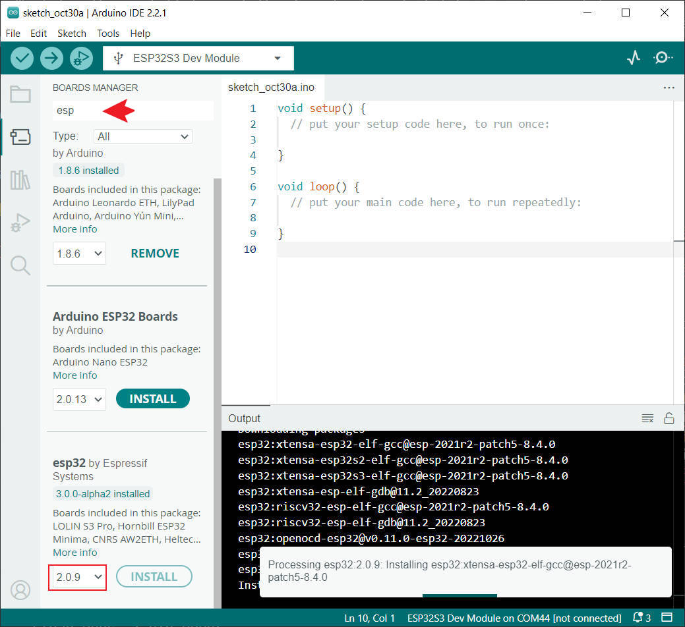

<h1 align = "center">🌟LilyGO T-Watch🌟</h1>

**[English](README.MD) | 中文**

## News:
- 当前`T-Watch-Lib` 仅仅适配了`T-Watch S3` 版本,esp32版本计划支持

## 1️⃣ PlatformIO Quick Start <推荐>

1. 安装[VisualStudioCode](https://code.visualstudio.com/) 和 [Python](https://www.python.org/)
2. 在`VisualStudioCode`扩展中搜索`PlatformIO`插件并安装.
3. 安装完成后需要将`VisualStudioCode`重新启动
4. 重新开启`VisualStudioCode`后,选择 `VisualStudioCode` 左上角的 `文件` -> `打开文件夹` ->选择 `TTGO_TWatch_Library` 目录
5. 等待安装第三方依赖库安装完成
6. 点击 `platformio.ini` 文件,在`platformio` 栏目中取消需要使用的示例行,请确保仅仅一行有效
7. 点击左下角的（✔）符号编译
8. 将板子与电脑USB进行连接
9. 点击（→）上传固件
10. 点击 (插头符号) 监视串行输出

## 2️⃣ Arduino IDE Quick Start

1. 安装 [ArduinoIDE](https://www.arduino.cc/en/software)
2. 安装 `Arduino ESP32 2.0.9`
   
   * **请使用 2.0.9 ，新版本变更过大，目前还没有做适配**
3. 安装 [TTGO_TWatch_Library](https://github.com/Xinyuan-LilyGO/TTGO_TWatch_Library)
4. 安装 [T-Watch-Deps](https://github.com/Xinyuan-LilyGO/T-Watch-Deps)
   - 将[T-Watch-Deps](https://github.com/Xinyuan-LilyGO/T-Watch-Deps)里的所有目录拷贝到 `<C:\Users\UserName\Documents\Arduino\libraries>`,如果没有`libraries`目录,请新建.
   - 请注意,不是拷贝`T-Watch-Deps`目录,而是拷贝`T-Watch-Deps`目录里面的文件夹到<libraries>
   - 请注意,当前第三方库仅仅只有<TFT_eSPI>进行了[预配置](https://github.com/Xinyuan-LilyGO/T-Watch-Deps/blob/be311130018708903d5ed1e524b73d670a2e18f1/TFT_eSPI/User_Setup_Select.h#L143),当升级了<TFT_eSPI>之后你需要重新将<extras/Setup212_LilyGo_T_Watch_S3.h>移动到<TFT_eSPI/User_Setups>目录内,并且在[TFT_eSPI/User_Setup_Select.h](https://github.com/Xinyuan-LilyGO/T-Watch-Deps/blob/be311130018708903d5ed1e524b73d670a2e18f1/TFT_eSPI/User_Setup_Select.h#L143)中添加`#include <User_Setups/Setup212_LilyGo_T_Watch_S3.h>`
5. 打开ArduinoIDE -> Tools 
   - Board -> ESP32S3 Dev Module
   - USB CDC On Boot -> Enable   # 注意，在不连接USB的时候你需要将Enable改为Disable，这样USB CDC 不会阻止板子的启动
   - CPU Frequency -> 240MHz
   - USB DFU On Boot -> Disable
   - Flash Mode -> QIO 80MHz
   - Flash Size -> 16MB(128Mb)
   - USB Firmware MSC On Boot -> Disable
   - PSRAM -> OPI PSRAM
   - Partition Scheme -> 16M Flash(3MB APP/9.9MB FATFS)
   - USB Mode -> Hardware CDC and JIAG
   - Upload Mode -> UART0/Hardware CDC
   - Upload Speed -> 921600
5. 插入USB到PC,点击上传<如果无法顺利上传,请查看下方FAQ>

<h2 align = "left">4️⃣ Example Source </h2>

- **display 目录**  示例来源于  [TFT_eSPI](https://github.com/Bodmer/TFT_eSPI/tree/master/examples) 
- **lvgl 目录** 示例来源于  [lvgl](https://github.com/lvgl/lvgl/tree/master/examples)  
- **radio 目录** 示例来源于  [RadioLib](https://github.com/jgromes/RadioLib/tree/master/examples/SX126x) 
- **peripheral 目录** 示例来源于 [XPowersLib](https://github.com/lewisxhe/XPowersLib/tree/master/examples) & [SensorsLib](https://github.com/lewisxhe/SensorsLib/tree/master/examples) 

<h2 align = "left">5️⃣ ESP32 basic examples </h2>

- [BLE Examples](https://github.com/espressif/arduino-esp32/tree/master/libraries/BLE)
- [WiFi Examples](https://github.com/espressif/arduino-esp32/tree/master/libraries/WiFi)
- [SPIFFS Examples](https://github.com/espressif/arduino-esp32/tree/master/libraries/SPIFFS)
- [OTA Examples](https://github.com/espressif/arduino-esp32/tree/master/libraries/ArduinoOTA)
- [FFat Examples](https://github.com/espressif/arduino-esp32/tree/master/libraries/FFat)
- 更多esp32示例,请在这里查看 [arduino-esp32-libraries](https://github.com/espressif/arduino-esp32/tree/master/libraries)

<h2 align = "left">6️⃣ FAQ </h2>

1. 无法上传示例
   1. 确保T-Watch已经开机,可以按照下面方法进行查看,打开电脑设备管理器,查看端口，插入USB端口到电脑，显示了新的COM设备，则已经开机，如果没有显示，则按压表冠上的按键一秒，然后会弹出设备端口,此时点击上传

2. USB端口在电脑中不断闪现
* 这是程序运行异常,或者是选择了错误的配置,esp32不断重启导致的现象,这时只能将手表手动进入下载模式才能解决不能上传的问题
请遵顼下面的步骤操作
  1. 拆开后盖
  2. 插入Micro-USB
  3. 打开Windows设备管理器
  4. 长按手表表冠,直到 Windows COM 端口中不出现 USB 的设备
  5. 按压下图按键保持按压
   
  6. 按压表冠按钮一秒
  7. 此时COM端口则固定
  8. ArduinoIDE 中选择Port
  9.  点击上传

3. 在哪里查询引脚定义?
   1. 看[这里](./src/utilities.h)
4. 上传草图之后屏幕没有显示?
   1. 请查看[Arduino IDE Quick Start]()第四行
5. 电源域
   | Power Domain | Role                          |
   | ------------ | ----------------------------- |
   | ALDO1        | RTC backup battery (3.1-3.3v) |
   | ALDO2        | Backlight                     |
   | ALDO3        | 3V3 for FT6336 and st7889     |
   | ALDO4        | SX1262                        |
   | BLDO2        | DRV2605 Enable pin            |
   | DC1          | ESP32 3V3                     |
   | VRTC         | Nothing                       |

