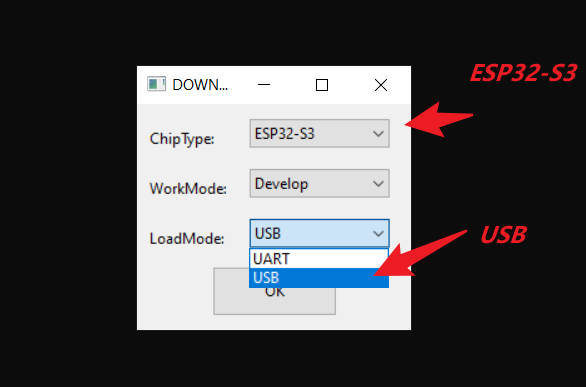
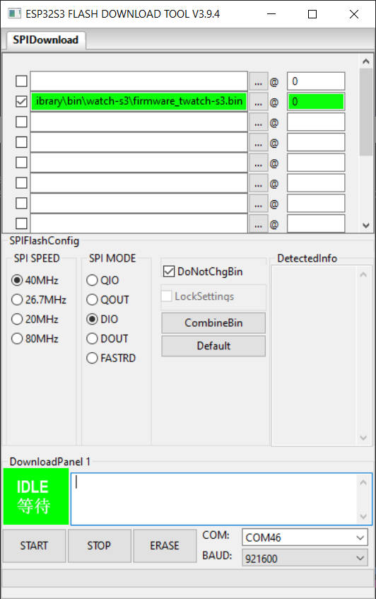
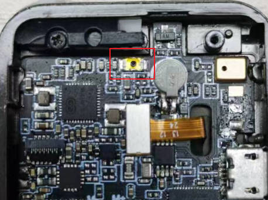

# Write factory firmware

* This method is used to detect whether the hardware is normal

* [RecordVideo](https://youtu.be/k0VfGREFaZE)

# Steps1

# Steps2

# Note

1. The USB port keeps flashing in the computer
* This is a phenomenon caused by the abnormal operation of the program, or the selection of the wrong configuration, and the continuous restart of the esp32. At this time, the problem of not being able to upload can only be solved by manually entering the download mode of the watch
Please follow the steps below
   1. Remove the back cover
   2. Insert Micro-USB
   3. Open Windows Device Manager
   4. Press and hold the crown of the watch until the USB device does not appear in the Windows COM port
   5. Press the button in the picture below and keep pressing

    

    
   6. Press the crown button for one second
   7. Now the COM port is fixed
   8. Select Port in `ESP32 DOWNLOADER TOOL`
   9.  Click `START`